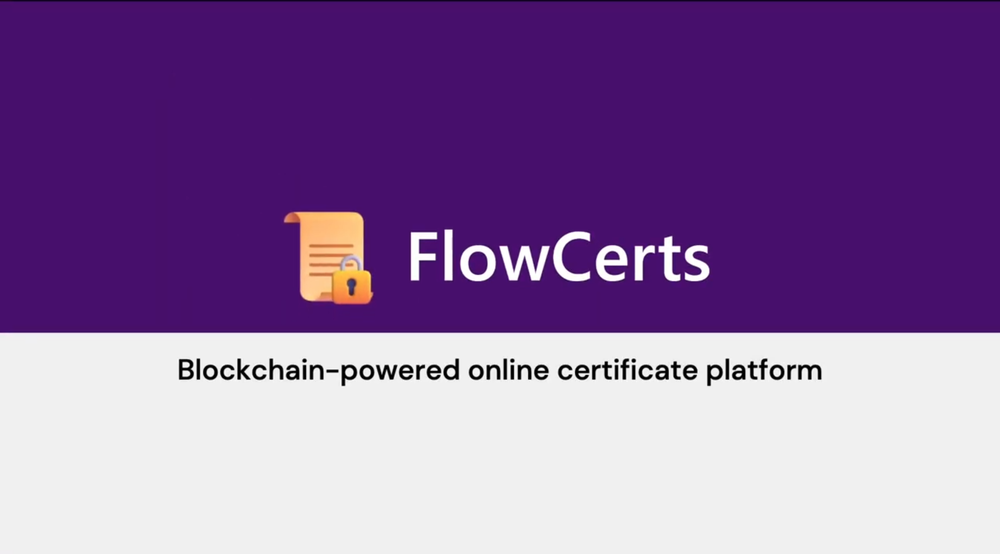

# FlowCerts
The blockchain-powered online certificate management platform, built on Flow and Chainlink.

2023 Team FlowCerts

Thank you for organising this interesting hackathon!

## Watch the Video

https://www.youtube.com/watch?v=oDXE1yjMEmg

## What is FlowCerts?

FlowCerts provides a user-friendly and uncomplicated web application for organisations to upload educational certificates to the Flow blockchain.

### Account Setup

After signing up with a Flow-compatible wallet, organisations should verify ownership of their website by inserting a DNS record generated by Chainlink Verifiable Random Function for maximum security and verifiability. The DNS record is then checked using Chainlink Functions' Decentralised Oracle Network.

An organisation's web domain is a key feature to help others verify that a certificate originates from them, hence the need to verify it.

Once verified, FlowCerts stores Cadence resources and capabilities in the organisation's Flow account, allowing their Flow account to create certificate collections and issue certificates.

### Verification Card and Issuing Certificates

When organisations issue PDF certificates using FlowCerts, a card with information on how to verify the certificate including a QR code and link can be embedded into the PDFs, along with metadata to allow FlowCerts to identify the certificate.

FlowCerts' web app provides tools which organisations may use to customise the card's appearance.

Once certificates are uploaded, FlowCerts lets organisations download CSV files containing the various links for each certificate associated with the uploaded filenames, allowing organisations to easily share the links.

### Verifying Certificates

FlowCerts also provides a web app where anyone can either use a FlowCerts URL (printed on each FlowCerts PDF) or upload a FlowCerts PDF to verify a FlowCerts certificate. FlowCerts loads the metadata from the certificate or URL and compares it with the data on the Flow blockchain, among other checks, in order to verify its integrity and authenticity.

## How we built it

FlowCerts started as a collection of Cadence smart contracts which defined the core behaviour of FlowCerts certificates and user privileges. Then, Node.js code which used Flow Client Library (FCL) to interact with these smart contracts on the Flow blockchain was written and incorporated into a Fastify backend. Then, we wrote code for the backend to interact with Chainlink VRF and Functions subscriptions for the organisation verification functionality.

Much of the smart contract interaction is done on the frontend too, using FCL, to enhance FlowCerts' decentralisation and security. The frontend is built in Vue.js and TailwindCSS, with various UI components from Flowbite.

## Using / Testing FlowCerts

FlowCerts is currently on testnet.

Sign up for FlowCerts here: https://flowcerts.net/login.html

Verify certificates here:
https://flowcerts.net/verify.html

We recommend using Blocto wallet to test, as FlowCerts was mostly tested with the Blocto wallet. We also recommend using the testnet faucet to transfer more FLOW to your address used for testing as the default 0.001 FLOW may be insufficient to store many certificates' metadata.
